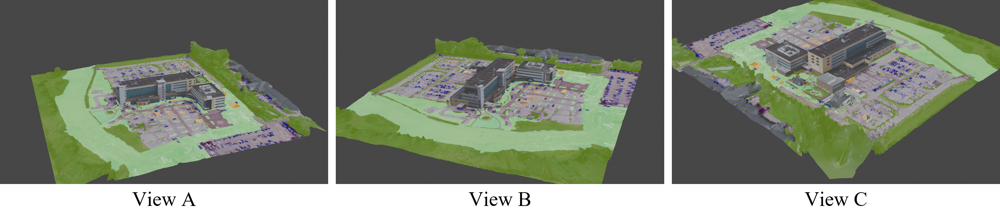
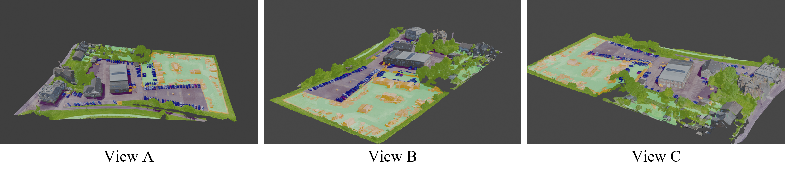
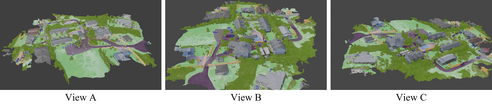
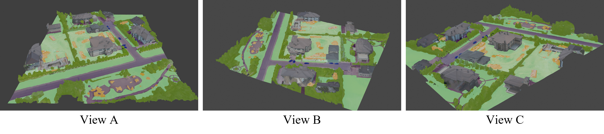
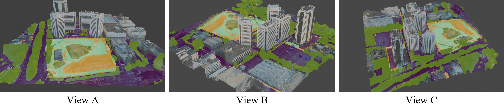

# Datasets for Viewpoint-tolerant Semantic Segmentation

## Description

This Readme.md will introduce the training and test datasets used in the paper "Viewpoint-tolerant Semamtic Segmentation in Aerial Logistics". Please follow this [link](https://drive.google.com/drive/folders/1hCqNp1Ocsfh09h2DIdQ1YbMK59lOrjXe?usp=sharing) to download the zipped datasets. All the datasets are collected from the custom-made Vulkan-based drone simulator. 


Data is sampled over 5 models: **hospital**, **garden**, **warehouse**, **house garden** and **skyscrapres**. The technical details will be given in the `Dataset` part. Each model contains respectively training dataset, named `circle`, and test datasets, named `star`. Please refer the [original paper](https://drive.google.com/file/d/1osWNN6gEZ7sYJxYSgf7CCihI548JsLN9/view?usp=sharing) for the detailed sampling approach. Data is sampled at different viewpoints above the model and at each viewpoint 4 different kinds of information are collected:
+ rgb image, in ros topic `/fireflyvrglasses_for_robots_ros/color_map`, `.png` format with resolution of `480x752`
+ semantic annotation, in ros topic `/firefly/vrglasses_for_robots_ros/semantic_map`, `.png` format with resolution of `480x752`
+ depth information, in ros topic `/firefly/vrglasses_for_robots_ros/depth_map `, `.exr` format with resolution of `480x752`
+ camera position information, in ros topic `/firefly/vrglasses_for_robots_ros/camera_odometry_out`, `.csv` format, contains timestamp, positions (`x`,`y`,`z`) and orientations (`x`,`y`,`z`, `w`)

## Citation
If you find this work useful please cite the paper using the citation below.
```
@inproceedings{wang2021viewpointsemantic,  
  title={Viewpoint-tolerant Semamtic Segmentation in Aerial Logistics},  
  author={Wang, Shiming and Maffra, Fabiola and Mascaro, Ruben and Teixeira, Lucas and Chli, Margarita},  
  booktitle = {Proc. of the German Conference on Pattern Recognition (GCPR)},  
  year={2021}  
}
```

## Semantic Class Definition
| Class       | Palette                                                      |             Color Example             | Description                                                                                                                  |
|-------------|--------------------------------------------------------------|:-------------------------------------:|------------------------------------------------------------------------------------------------------------------------------|
| **Pavement** | RGB: (81, 0, 81)<br/>HEX: #510051  |    | Man-made flat ground, asphalt, sidewalk, which are easy to traverse by all wheeled vehicles.                                 |
| **Terrian** | RGB: (152, 251, 152)<br/>HEX: #98FB98                        |     | Bare terrain, grass fields, mud, which can be traversed by off-road wheeled vehicles.                                        |
| **Water**   | RGB: (150, 170, 250)<br/>HEX: #96AAFA                        |       | Lake, sea, rivers, swimming pool and so on.                                                                                  |
| **Sky**     | RGB: (70, 130, 180)<br/>HEX: #4682B4                         |         | Sky.                                                                                                                         |
| **Building** | RGB: (70, 70, 70)<br/>HEX: #464646                           |    | All types of edification, including the windows, doors, and rooftops.                                                        |
| **Vegetation** | RGB: (107, 142, 35)<br/>HEX: #6A8E23                         |  | Trees, bushes, plants, which are not easy to traverse by any wheeled vehicle.                                                |
| **Person**  | RGB: (220,20,60)<br/>HEX: #DC143C                            |      | Pedestrians.                                                                                                                 |
| **Rider**   | RGB: (255,0,0)<br/>HEX: #FF000                               |      | Bicyclists and motorcyclists.                                                                                                |
| **Vehicle** | RGB: (0,0,142)<br/>HEX: #0008E                               |     | Car, truck, train, boat and so on.                                                                                           |
| **Others & Unlabeled** | RGB: (0,0,0)<br/>HEX: #00000                                 |      | Elements that do not fit any other class or areas without a model, such as trash bins, background, or failures on the model. |

## Dataset

### Hospital

<div style="text-align: center;">
    
    Multi views of hospital model
</div>

+ **circle**:   
    * **sampling position**: height 90 m, pitch angle -60°
    * **number of images**: 288
+ **star**:
    * **number of images in each sub-dataset**: 432
### Warehouse

<div style="text-align: center;">
    
    Multi views of rehouse model
</div>

+ **circle**:   
    * **sampling position**: height 40 m, pitch angle -60°
    * **number of images**: 216
+ **star**:
    * **number of images in each sub-dataset**: 225

### Garden
<div style="text-align: center;">
    
    Multi views of garden model
</div>

+ **circle**:   
    * **sampling position**: height 60 m, pitch angle -60°
    * **number of images**: 216
+ **star**:
    * **number of images in each sub-dataset**: 225

### House Garden
<div style="text-align: center;">
    
    Multi views of house garden model
</div>

+ **circle**:   
    * **sampling position**: height 40 m, pitch angle -60°
    * **number of images**: 288
+ **star**:
    * **number of images in each sub-dataset**: 225
  
### Skyscrapers

<div style="text-align: center;">
    
    Multi views of house garden model
</div>

+ **circle**:   
    * **sampling position**: height 90 m, pitch angle -60°
    * **number of images**: 288
+ **star**:
    * **number of images in each sub-dataset**: 480

## Data Structure

Each single dataset has the following file structure:  
```
.
├── ann_dir_1            # root of annotated semantic maps
├── image_dir            # root of rgb images
├── depth0               # root of depth information
└── gt_odometry0  
    └── data.csv         # recorded pose information
```

